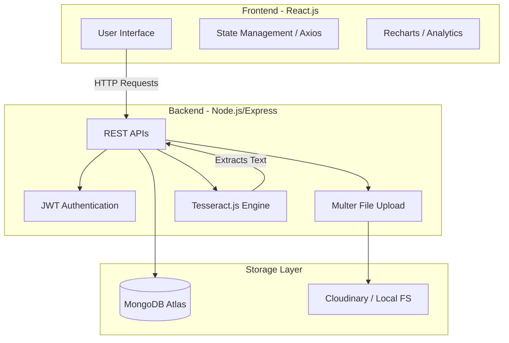
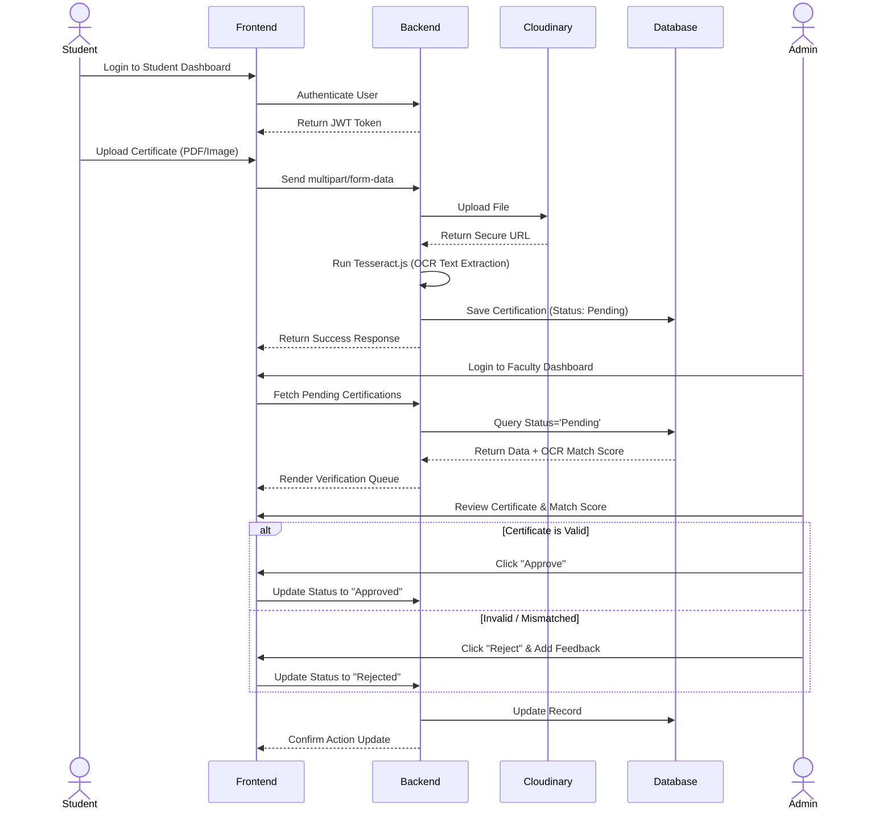
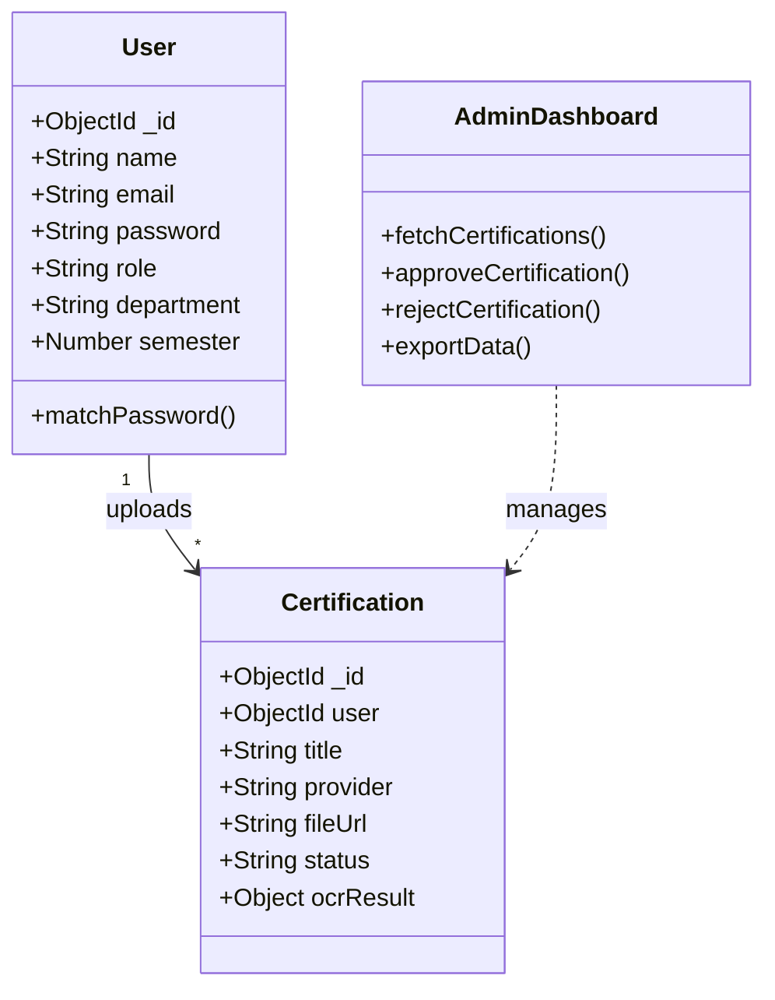
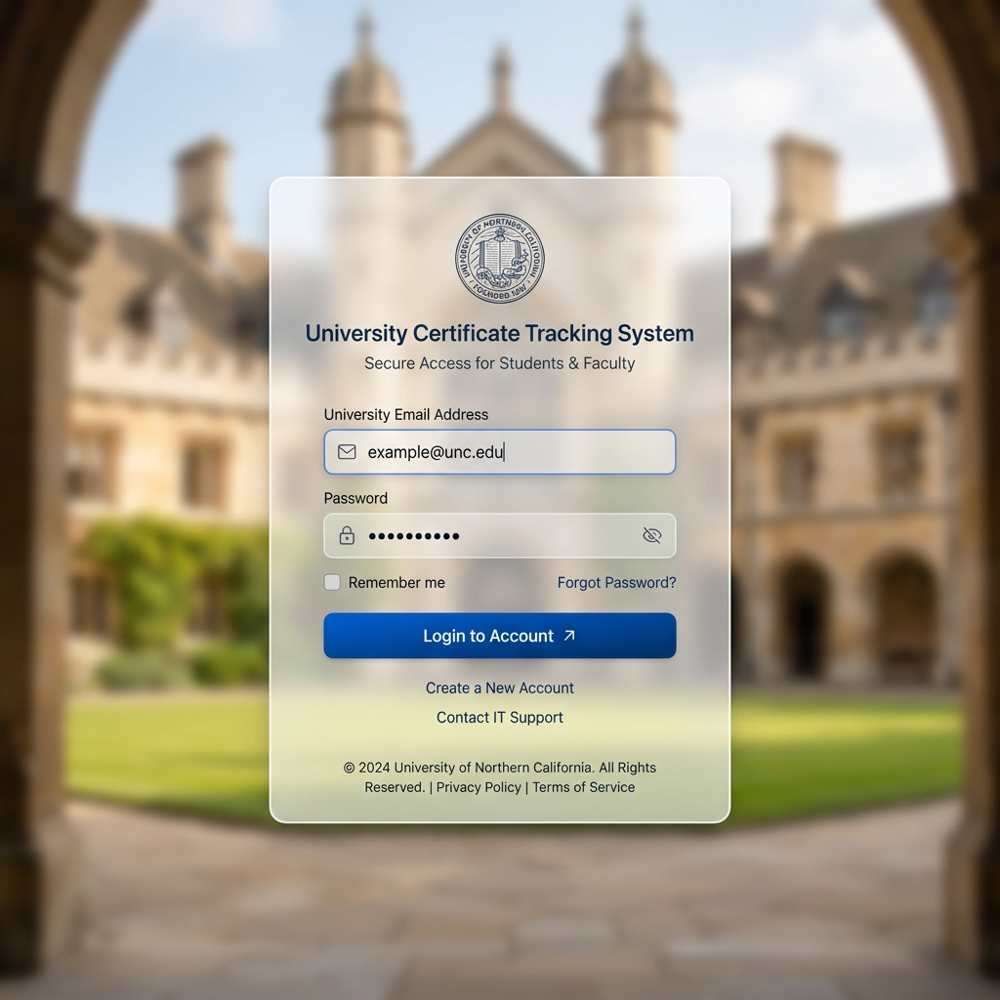
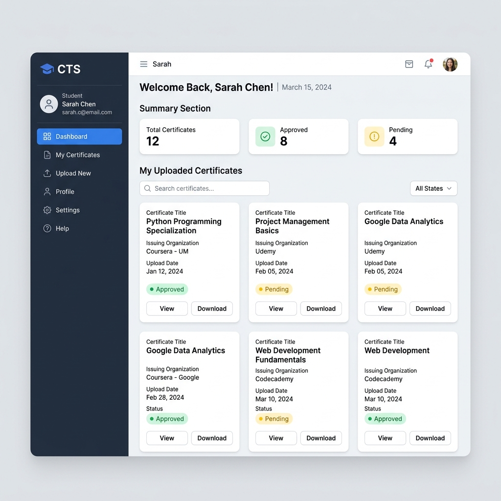
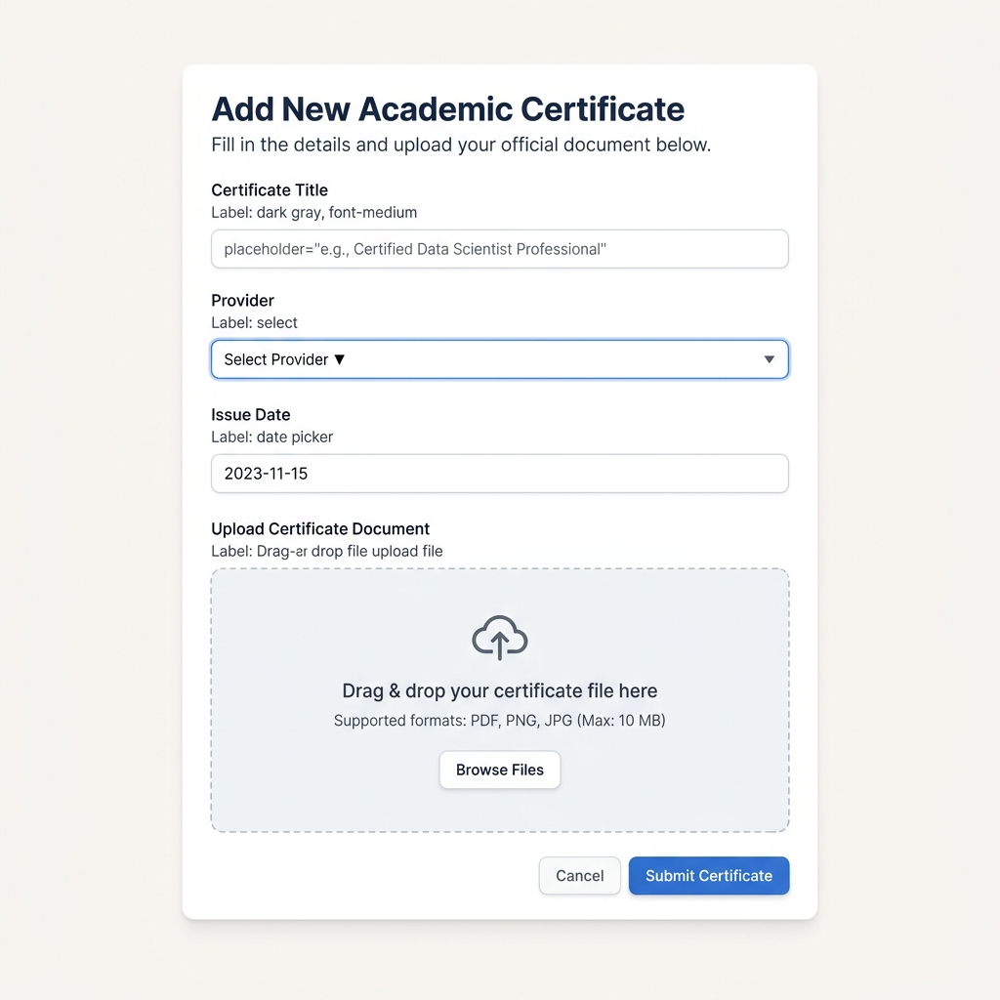
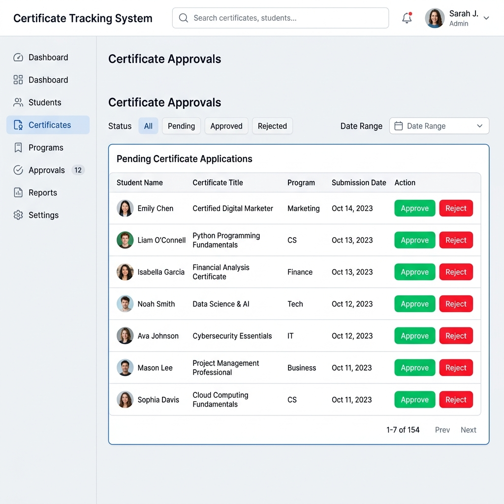
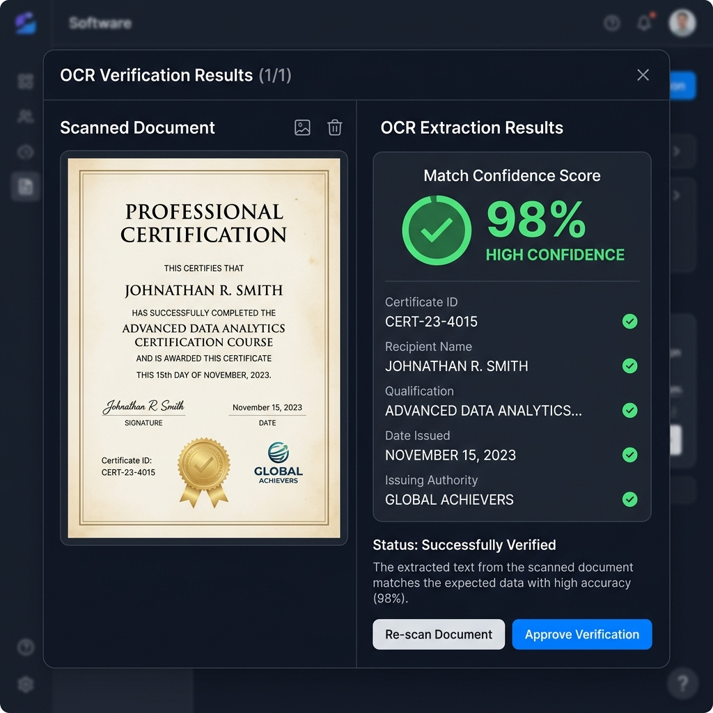
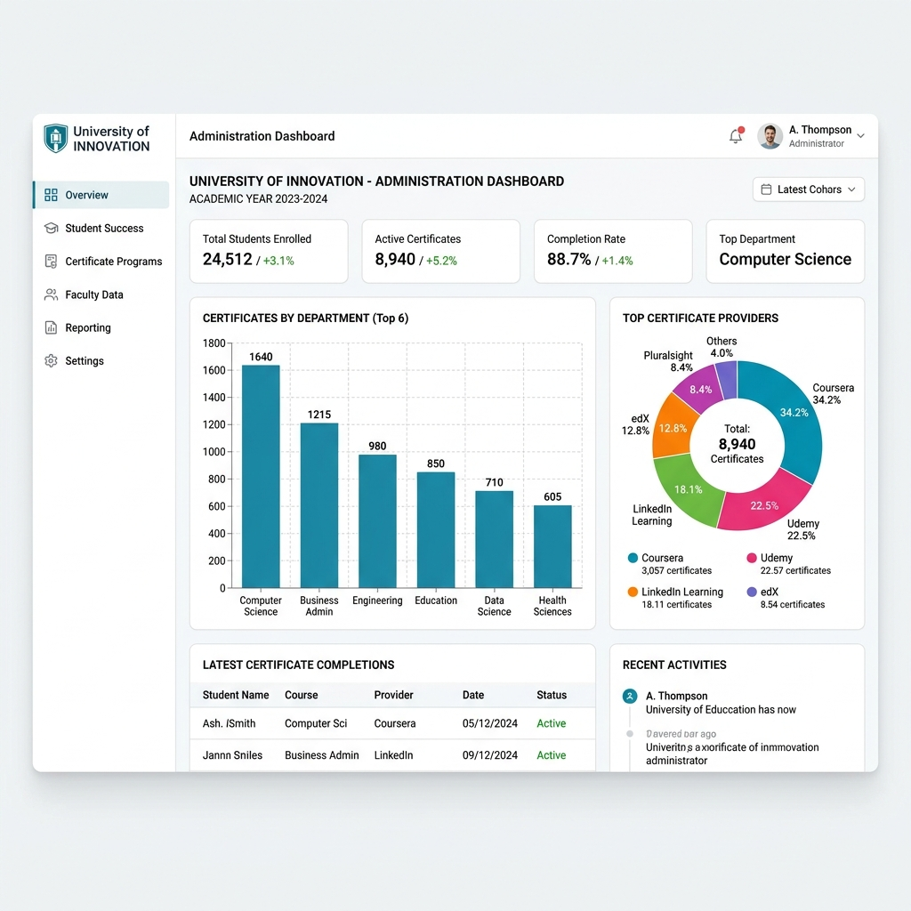
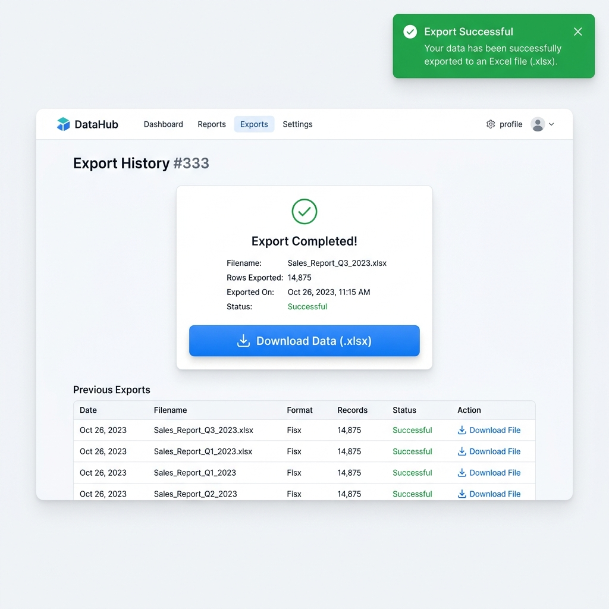

# Chapter 1

## Introduction

"An investment in knowledge pays the best interest." — Benjamin Franklin

In the modern academic landscape, institutions encourage students to pursue extracurricular certifications to enhance their skill sets. However, tracking, verifying, and managing these certificates manually or via generic cloud storage has become a logistical challenge. The **Certificate Tracking System** emerges as a centralized, secure platform designed to bridge the gap between student achievements and institutional verification.

The Certificate Tracking System functions as an "Academic Portfolio Manager," leveraging OCR (Optical Character Recognition) to assist in preliminary validation while serving as a secure conduit for faculty and administrators to review and approve student certifications. Unlike traditional physical filing or unorganized digital folders, this system ensures every uploaded certificate is structured, verified, and integrated into an institution-wide analytics dashboard.

### 1.1 Project Objectives

The core mission of the Certificate Tracking System is defined by the following goals:
*   **Centralization:** To provide a single, organized repository for students to upload and manage their academic and professional certificates.
*   **Verification:** To utilize OCR technology (`tesseract.js`) to cross-reference the text on the certificate with the student's details, assisting faculty in the verification process.
*   **Efficiency:** To streamline the faculty-student interaction, allowing administrators to view categorized certifications, filter by departments, and generate structured Excel reports for accreditation (like NAAC/NBA).

### 1.2 Academic & Institutional Impact

By digitizing the certification workflow, the system empowers students to build a verifiable digital portfolio while optimizing the time of faculty members. It moves away from disorganized manual data entry and static Excel sheets to a dynamic, real-time tracking dashboard, significantly improving the institution's ability to monitor student progress and placement readiness.

### 1.3 Operational Workflow

The system operates through a structured three-step process:
1.  **Upload & OCR Analysis:** The student logs in and uploads their certificate (e.g., Coursera, Udemy) via an intuitive dashboard. The backend utilizes Cloudinary for secure storage and Tesseract.js to scan the document for matching names or keywords, providing a confidence score.
2.  **Verification Queue:** The uploaded certificate is marked as "Pending" and appears in the faculty/admin real-time dashboard. The AI's preliminary OCR results (isMatch, confidence) are displayed to assist the reviewer.
3.  **Professional Review & Analytics:** The faculty reviews the certificate. They can then:
    *   **Approve** the certificate.
    *   **Reject** it with specific feedback.
    *   The approved data instantly updates the institution's analytics (Recharts), plotting certifications by provider, year, and department.

### 1.4 Technological Foundation

The system is built upon a robust, modern technology stack designed for performance and scalability:
*   **Backend:** Powered by Node.js and Express, ensuring capable handling of simultaneous file uploads and API traffic.
*   **Database:** Utilizes MongoDB (with Mongoose) for a highly flexible NoSQL database schema capable of handling diverse user and certificate metadata.
*   **Frontend:** Constructed with React.js (Vite) and Tailwind CSS, providing a responsive, dynamic Single Page Application (SPA) experience across all devices.

---

# Chapter 2

## Literature Survey

### 2.1 Introduction

To understand the necessity of a dedicated Certificate Tracking System, a survey of existing academic record-keeping methods and commercial portfolio platforms was conducted. The study focuses on the transition from physical records to digital storage, the rise of academic ERPs, and the persistent gaps in specific certification validation.

### 2.2 Existing Systems

Currently, the landscape is dominated by three main approaches:
1.  **Manual Physical Filing / Google Forms:** Institutions often use Google Forms where students upload PDFs, which are then manually downloaded and sorted into Excel sheets by faculty.
2.  **Generic Academic ERPs:** Systems that handle attendance and fees but offer only basic file upload fields without validation or specific analytics for extracurricular achievements.
3.  **Professional Networks (e.g., LinkedIn):** Platforms where students showcase certificates, but which lack backend institutional oversight, verification workflows, and bulk reporting tools required by colleges.

### 2.3 Limitations

Despite being widely used, existing methods suffer from critical drawbacks:
*   **Data Fragmentation:** Using Google Forms results in scattered data across multiple Drive folders, making it nearly impossible to quickly generate aggregated reports for accreditation bodies.
*   **Lack of Automated Verification:** Faculty must manually read every single certificate to ensure the student didn't upload a fake or incorrect document, which is highly time-consuming.
*   **Poor Analytics:** Extracting insights (e.g., "How many CSE students completed AWS certifications this month?") requires complex, manual spreadsheet manipulation.

### 2.4 Research Gap

A clear gap exists for a "Verification-First" platform that sits between generic cloud storage and a full-scale ERP. There is a lack of platforms that offer:
1.  **Instant OCR Scanning** to flag potentially mismatched documents immediately.
2.  **Institutional Dashboards** that automatically convert approved certificates into actionable graphs and exportable reports (XLSX).
The proposed Certificate Tracking System addresses this specific gap by offering a specialized workflow tailored specifically for educational institutions.

---

# Chapter 3

## System Analysis

### 3.1 Existing System

The traditional process involves a manual workflow. When a student completes a course, they print the certificate or email a PDF to their faculty advisor. The faculty then manually updates an Excel sheet. 

*   **Drawbacks:**
    *   **Time-Consuming:** Significant administrative overhead for faculty.
    *   **Prone to Loss:** Physical copies or email attachments are easily lost or misplaced.
    *   **No Central Dashboard:** Students cannot see their cumulative progress, and administration cannot view institutional metrics at a glance.

### 3.2 Proposed System

The proposed system is a web-based, full-stack platform (MERN) that integrates document upload with OCR-assisted validation and professional faculty oversight.
*   **Advantages:**
    *   **Centralized Repository:** Immediate access to all student certificates anytime, anywhere.
    *   **Verified Authenticity:** All certificates are either "Pending," "Approved," or "Rejected" with feedback, backed by OCR matching.
    *   **Data-Driven:** Automated analytics and one-click Excel report generation.

### 3.3 Functional Requirements

1.  **Student Module:**
    *   **Registration/Login:** Secure access using email and password.
    *   **Upload Certificate:** Input fields for Title, Provider, Date, Tags, and file upload (Image/PDF).
    *   **Portfolio View:** Display uploaded certificates with their current status (Pending/Approved/Rejected) and faculty feedback.
2.  **Faculty/Admin Module:**
    *   **Dashboard View:** Real-time list of pending student uploads.
    *   **Verification Management:** Ability to view the document, check OCR confidence, and Approve or Reject.
    *   **Analytics & Export:** View charts (by department/provider) and export data to CSV/Excel.
3.  **Core System:**
    *   **OCR Engine:** Extract text from images/PDFs to verify the student's name against the certificate text.
    *   **Cloud Storage:** Integration with Cloudinary for scalable file hosting.
    *   **Email Notifications:** Alerts via Nodemailer for password resets and status updates.

### 3.4 Non-Functional Requirements

1.  **Performance:** The system should load the dashboard in under 2 seconds and process file uploads to Cloudinary swiftly.
2.  **Scalability:** The Node.js backend must handle concurrent uploads during peak submission deadlines.
3.  **Security:**
    *   Passwords must be hashed using Bcrypt.
    *   API routes protected via JWT (JSON Web Tokens).
4.  **Usability:** The React + Tailwind UI must be fully responsive on mobile devices for students.

---

# Chapter 4

## System Design

### 4.1 System Architecture

The system follows a modern Client-Server RESTful architectural pattern.
*   **Client (Frontend):** Built with React.js and Vite. Handles the user interface, state management, and routing.
*   **API Layer (Backend):** Node.js & Express server handling routing, JWT authentication, OCR processing, and file handling via Multer.
*   **Data Layer (Database):** MongoDB Atlas (cloud database) storing Users, Certifications, and Departments. Cloudinary serves as the Blob storage for actual files.



### 4.2 Operational Workflow Diagram

The sequence diagram below visualizes the step-by-step process a user follows from login to certificate verification, demonstrating the interaction between the Student, the System (OCR & Cloud Storage), and the Admin.



### 4.3 UML Diagrams

**Class Diagram:**
The following diagram illustrates the relationship between the primary entities within the Certificate Tracking System.



### 4.4 Database Design

The NoSQL database (MongoDB) is designed with Mongoose schemas.

**Table 4.1: User Collection Schema**
| Field Name | Data Type | Constraint | Description |
| :--- | :--- | :--- | :--- |
| `_id` | ObjectId | PK, Auto | Unique user identifier |
| `name` | String | Not Null | Full name of the user |
| `email` | String | Unique, Not Null | Email address for login |
| `password` | String | Not Null | Hashed password |
| `role` | String | Enum | 'student', 'faculty', or 'admin' |
| `rollNo` | String | Unique | Student Roll Number |

**Table 4.2: Certification Collection Schema**
| Field Name | Data Type | Constraint | Description |
| :--- | :--- | :--- | :--- |
| `_id` | ObjectId | PK, Auto | Unique certificate ID |
| `user` | ObjectId | FK (User) | Reference to the student |
| `title` | String | Not Null | Course/Certificate title |
| `provider` | String | Not Null | Platform (e.g., Coursera) |
| `fileUrl` | String | Not Null | Cloudinary secure URL |
| `status` | String | Enum | 'Pending', 'Approved', 'Rejected' |
| `ocrResult`| Object | - | Contains match status & confidence |

---

# Chapter 5

## Technology Stack

### 5.1 Frontend Technologies
*   **React.js (v19):** A JavaScript library for building user interfaces, chosen for its component-based architecture.
*   **Vite:** A modern, blazing-fast build tool that significantly improves the frontend development experience.
*   **Tailwind CSS:** A utility-first CSS framework used for creating responsive, modern "Glassmorphism" and clean data-table designs.
*   **Recharts & XLSX:** Libraries for rendering dynamic analytics charts and exporting tabular data into Excel formats.

### 5.2 Backend Technologies
*   **Node.js & Express.js:** The runtime environment and framework handling the REST API routing, middleware, and request processing.
*   **JSON Web Tokens (JWT):** Used for stateless, secure user authentication and role-based route protection.
*   **Bcrypt:** Used for hashing passwords before storing them in the database.
*   **Multer & Cloudinary:** Multer handles `multipart/form-data` (file uploads), which is piped directly to Cloudinary for scalable, secure cloud storage.
*   **Nodemailer:** Used to send automated emails (e.g., "Forgot Password" links).

### 5.3 Database Technologies
*   **MongoDB:** A NoSQL document database chosen for its flexibility in handling complex objects like the `ocrResult`.
*   **Mongoose:** An Object Data Modeling (ODM) library for MongoDB and Node.js, providing strict schema validation.

### 5.4 AI & Logic Tools
*   **Tesseract.js:** A pure JavaScript port of the popular Tesseract OCR engine. It analyzes the uploaded certificate images to extract raw text, which is then cross-referenced against the `user.name` to ensure authenticity.

### 5.5 Development Environment
*   **IDE:** Visual Studio Code.
*   **Version Control:** Git and GitHub.
*   **API Testing:** Postman / Browser Network Tab.

---

# Chapter 6

## Implementation

### 6.1 Modules Description

**6.1.1 Authentication Module**
Handles user security using JWT and Bcrypt.
*   **Registration/Login:** Generates a JWT token upon credential verification.
*   **Role-Based Access Control (RBAC):** Middleware checks if the logged-in user is a 'student' or 'faculty' to restrict API endpoints (e.g., only faculty can hit the `/approve` route).

**6.1.2 Certificate Upload & Storage Module**
The core operational module for students.
*   **Upload:** Form data and file are sent to the backend.
*   **Processing:** The backend uses `multer-storage-cloudinary` to upload the file to the cloud.
*   **OCR:** `Tesseract.js` scans the file buffer. If the student's name is found in the extracted text, `isMatch` is set to true.

**6.1.3 Verification & Analytics Module**
Facilitates interaction for faculty.
*   **Review Queue:** Faculty see a grid of pending certificates.
*   **Action:** Faculty click "Approve" or "Reject" (adding `adminFeedback`).
*   **Export:** The frontend fetches all approved certificates and uses the `xlsx` library to generate a downloadable spreadsheet.

### 6.2 Backend Working & Workflow

The backend serves as the bridge between the React frontend and the MongoDB database. It is entirely RESTful and relies on Express.js middleware for modular processing.

**Upload & Verification Workflow:**
1. **Request Intake:** The React client sends a `multipart/form-data` request containing the certificate metadata (Title, Provider, etc.) and the actual file.
2. **Multer Middleware:** Express intercepts the request using `multer`. The file is stored in the local `/uploads` directory (or piped to Cloudinary).
3. **Database Pre-Save Validation:** The Mongoose schema validates that all required fields are present.
4. **OCR Processing (Asynchronous):** The `Tesseract.js` engine reads the stored image file. It extracts the raw text and runs a string matching algorithm against the logged-in user's name. It calculates a boolean `isMatch`.
5. **Data Persistence:** The complete metadata object, along with the file URL and the OCR results, is saved to the MongoDB `Certifications` collection.
6. **Response:** A JSON response is returned to the client, triggering the frontend to update its state and render the new "Pending" certificate in the UI.

### 6.3 Algorithms Used

**OCR Verification Algorithm**
This algorithm acts as the first line of defense against fake uploads.
1.  **Extraction:** Tesseract reads the image buffer and returns a large block of `rawText`.
2.  **Normalization:** Both the `rawText` and the `user.name` are converted to lowercase, and extra whitespaces are removed.
3.  **Matching:** A substring search checks if the normalized user name exists within the normalized certificate text.
4.  **Scoring:** A `confidence` score is saved to the database. If no match is found, a warning is attached to the `ocrResult` object to alert the faculty.

### 6.4 Code Snippets Explanation

**Mongoose Pre-Save Hook (Security):**
```javascript
userSchema.pre('save', async function () {
    if (!this.isModified('password')) return;
    const salt = await bcrypt.genSalt(10);
    this.password = await bcrypt.hash(this.password, salt);
});
```
*Explanation:* This function automatically runs before a user is saved to MongoDB. It checks if the password was changed, generates a secure salt, and hashes the password using Bcrypt, ensuring plain-text passwords are never stored.

**Cloudinary Upload Integration:**
```javascript
// Example conceptual flow
const storage = new CloudinaryStorage({
  cloudinary: cloudinary,
  params: { folder: 'certificates', allowedFormats: ['jpeg', 'png', 'pdf'] },
});
const upload = multer({ storage: storage });
```
*Explanation:* Integrates Multer with Cloudinary. When a request hits an endpoint with this middleware, the file is streamed directly to Cloudinary, and the secure URL is attached to `req.file.path` to be saved in MongoDB.

---

# Chapter 7

## Results and Discussions

The Certificate Tracking System was successfully implemented and tested. Below is a detailed description of the core features developed, along with placeholders for their respective visual outputs.

> [!NOTE]
> Run your application locally, take screenshots of the specific features described below, and replace the `[Insert ... Screenshot Here]` text with your images.

### 7.1 Secure Authentication System
**Description:** The application features a robust role-based authentication system. Users can register and log in as either a 'Student' or 'Faculty/Admin'. The backend uses Bcrypt to hash passwords and issues a JSON Web Token (JWT) upon successful login, ensuring that subsequent API requests are stateless and secure. The UI provides real-time form validation and error handling (e.g., "Invalid Credentials" or "User Already Exists").
**Output Screen:**


### 7.2 Student Portfolio Dashboard
**Description:** Once logged in, students are greeted by a centralized dashboard. This interface displays their academic portfolio, showing a summary of total certificates uploaded, pending approvals, and rejected submissions. It renders a clean grid/list view of their documents, utilizing Tailwind CSS for a responsive, modern aesthetic. 
**Output Screen:**


### 7.3 Certificate Upload & Cloud Storage
**Description:** Students can seamlessly add new achievements via the Upload form. They input metadata such as the certificate title, provider (e.g., Coursera, NPTEL), and date. The file is uploaded directly to Cloudinary via Multer middleware. The system supports both image and PDF formats, returning a secure cloud URL that is stored in the MongoDB database.
**Output Screen:**


### 7.4 Faculty/Admin Verification Queue
**Description:** Faculty members access a dedicated, secure dashboard that fetches all "Pending" certificates across the institution. The data is presented in an interactive table. Faculty can view the uploaded document side-by-side with the student's claimed metadata and decide to either "Approve" or "Reject" the submission, providing specific feedback if rejected.
**Output Screen:**


### 7.5 Automated OCR Analysis
**Description:** To expedite the verification process, the system employs an Optical Character Recognition (OCR) engine (`tesseract.js`). When a certificate is uploaded, the backend scans the document's text and attempts to find a match with the logged-in student's name. The Admin Dashboard displays this as a "Confidence Score" or "Match Status" (e.g., a green badge for a match, a red warning if the name is not found on the certificate).
**Output Screen:**


### 7.6 Institutional Analytics & Data Visualization
**Description:** For administrative oversight, the system generates real-time analytics using the `Recharts` library. It visualizes data through dynamic bar charts and pie charts, such as the distribution of certifications across different engineering departments (e.g., CSE vs. ECE) or the popularity of various providers. This provides instant insights into institutional performance and student upskilling trends.
**Output Screen:**


### 7.7 Automated Excel Export
**Description:** To support accreditation processes (like NBA/NAAC requirements), the system includes a data export feature. Using the `xlsx` library, administrators can click a single button to download all "Approved" certification data into a structured Excel spreadsheet, completely eliminating manual data entry.
**Output Screen:**


---

# Chapter 8

## Conclusion and Future Scope

### 8.1 Conclusion
The integration of cloud storage, automated OCR validation, and role-based access control transforms the Certificate Tracking System from a simple file-upload tool into a powerful academic portfolio manager. The system is secure, user-friendly, and technically robust, effectively bridging the gap between student achievements and institutional verification. It successfully demonstrates that a centralized MERN stack application can significantly reduce administrative overhead while providing actionable insights for educational institutions.

### 8.2 Future Enhancements
To further improve the system, the following features are proposed:
1.  **Blockchain Verification:** Storing the hash of approved certificates on a public blockchain to create immutable, universally verifiable academic records.
2.  **LinkedIn Integration:** Allowing students to push their approved certificates directly to the "Licenses & certifications" section of their LinkedIn profiles via API.
3.  **Advanced AI Parsing:** Implementing a Large Language Model (LLM) instead of basic OCR to extract precise details like course duration, exact skills learned, and grading.
4.  **Gamification:** Introducing a "Leaderboard" on the student dashboard that ranks students based on the number of verified certifications to encourage upskilling.

---

## Bibliography
[1] MongoDB Documentation. "NoSQL Database Structure." mongodb.com.
[2] Node.js and Express.js Documentation. "REST API Routing."
[3] React.js Official Docs. "Component-Based UI Development."
[4] Tesseract.js Documentation. "Pure Javascript OCR."
